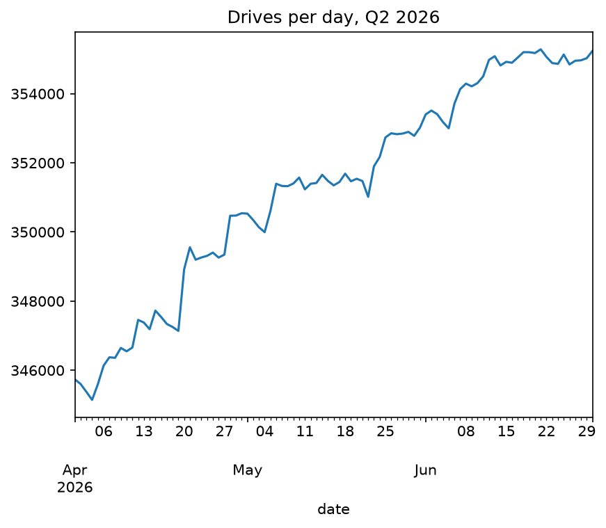

# Backblaze Drive Stats — Profiling Report

## Summary
- 13 years of daily drive snapshots; ~32 million rows per quarter today, ~100× more data per day than in 2013
- Schema grew from 85 to 197 columns; columns were only ever added, but every addition shifted positions → read by name
- Packaging quirks (macOS junk files, unordered files, varying folder names) → select files by date-named pattern only
- Identifier columns are zero-padded codes → integers; booleans change capitalisation between eras
- Quality: no duplicates, failed drives never reappear, very stable daily counts (max change +0.51%)
- Boot drives must be excluded to match Backblaze's AFR; rule: never had a slot AND under 1 TB
- Our Q2 2026 AFR: 1.76% vs Backblaze's 1.73% (remaining gap = their extra exclusions)

Notebooks: `exploration/01_one_day_profile.ipynb`, `02_schema_eras.ipynb`, `03_full_quarter.ipynb`

## 1. Size and growth
- Whole year 2013: 81 MB ZIP. Q2 2026: 1.9 GB ZIP (~12.6 GB uncompressed) → ~100× more data per day
- One day in 2026: ~130 MB CSV, 345,738 drives, 197 columns
- CSV compresses ~6.5× in ZIP

## 2. ZIP packaging
- One CSV per day; files inside a ZIP are NOT in date order
- Older ZIPs (2013 → at least Q3 2023) contain __MACOSX/ junk: one ._ file per CSV
  (639 junk entries across sampled ZIPs); Q2 2026 has none
- Folder name inside the ZIP varies by era ("2013/" vs "data_Q3_2023/")
- RULE: select only files named YYYY-MM-DD.csv outside __MACOSX/; never rely on folder
  names or file order; record skipped entries

## 3. Completeness
- Every quarterly ZIP sampled has every day of its quarter; no empty files
- Data begins 2013-04-10 (earlier 2013 dates absent by design)
- Others report empty days elsewhere in history → pipeline must record gaps
- RULE: check completeness against the expected calendar from the ZIP name

## 4. Schema history
- Columns per era: 85 (2013) → 95 (Q1 2016) → 179 (Q1 2023) → 186 (Q2 2023)
  → 193 (Q3 2023) → 197 (Q2 2026)
- Columns were only ever ADDED, never removed
- Every addition shifted other columns' positions (52–181 moved)
- RULE: always read columns by NAME, never by position
- Non-SMART columns: date, serial_number, model, capacity_bytes, failure (since 2013);
  vault_id, pod_id, is_legacy_format (Q2 2023); datacenter, cluster_id, pod_slot_num (Q3 2023)
- All other additions were SMART pairs (smart_N_normalized + smart_N_raw)
- No mid-quarter schema change in sampled ZIPs
- 2018+ history doc matches real headers exactly for Q1–Q3 2023
- Current doc misspells smart_211/212 as "normailized"; real data is correct
- RULE: verify documentation against data; trust the data
- The 2023 columns sit between failure and the SMART columns, not at the end of the header

## 5. Types and values
- DuckDB guesses types → pipeline must NEVER rely on guessed types; read as text, cast explicitly
- failure: only 0/1 → boolean
- is_legacy_format: "False" (2023) vs "false" (2026); always false in samples
  → parse booleans case-insensitively
- vault_id, pod_id, pod_slot_num, cluster_id: always numeric, zero-padded to fixed widths
  ("0007") → INTEGER in silver
- capacity_bytes > 0 in samples
- 112 of 186 SMART columns are >90% empty on a 2026 day (vendor-specific attributes)

## 6. Data quality findings
- 2026-04-01: each serial_number appears once; 14 failures (~1.48% AFR estimate vs
  Backblaze's 1.73% for Q2 2026)
- datacenter blank on 2023-07-01 for 6,100 drives = 5 whole vaults × 1,220 drives
  ("busy vault" cause) → fix via vault→datacenter lookup from other days, flagged as filled-in
- pod_slot_num empty for (a) boot drives (all their days) and (b) data drives around their failure
  day → "no slot" alone is NOT a boot-drive signal
- Model names have inconsistent formats (with/without brand) → needs normalization mapping

## 7. Hardware layout (inferred, consistent across checks)
- 20 pods per vault, 60 data slots per pod, 1 boot drive per pod → 1,220 drives per vault
- 6 datacenters in 2026: phx1, sac0, sac2, iad1, ams5, yyz1

## Full quarter scan (Q2 2026: 31,968,003 rows, 91 days)
- Parquet: 12.58 GB CSV → 0.31 GB Parquet (11 of 197 columns kept), query 16.6 s → ~0 s;
  conversion took 27 s
- No duplicate (date, serial_number) on any day; no blank datacenter all quarter
- Drives per day: 345,143 → 355,284, smooth growth; largest day-to-day change +0.51%
  → ±15% row-count audit is far too loose; ~±3% block / ±1% warn fits this quarter
- 1,522 drives failed; none seen again after failing; no drive changed capacity or model
- Failures per day: 3–42 (mean ~17)
- pod_slot_num goes blank on/around failure: 69% of failure rows have no slot vs 1.2% of normal rows
- Boot drive rule, decided per DRIVE (not per row): never had a slot in the period AND capacity < 1 TB
  → 3,949 boot drives, 0 failures (Backblaze: 3,881)
- AFR excluding boot drives: 1.76% vs Backblaze 1.73%; remaining gap = Backblaze's extra
  exclusions (705 HDDs not meeting criteria, small models) → replicate in Phase 4
- 122 drives ≥1 TB had no slot all quarter; 89 of them failed → strong trouble signal
- LESSON: a rule tested on one day looked right but was wrong across 91 days; the
  reconciliation against Backblaze's published AFR exposed it

## 8. Impact on the design
- Contract v1: the 11 non-SMART columns above with explicit types; SMART pairs auto-added
- Boot drives must be labelled (data vs boot) to match Backblaze's AFR, which excludes them;
  "no slot" works from Q3 2023, earlier eras need model/capacity rules
- ops.observed_schemas should store both an exact and an order-insensitive fingerprint

## 9. Open questions (Step 1.4 and later)
- Duplicates, row-count swings, re-appearing failed drives, capacity changes across a full quarter
- Schema gaps not sampled: 2014–2015, Q2 2016–2017
- How to identify boot drives before 2023